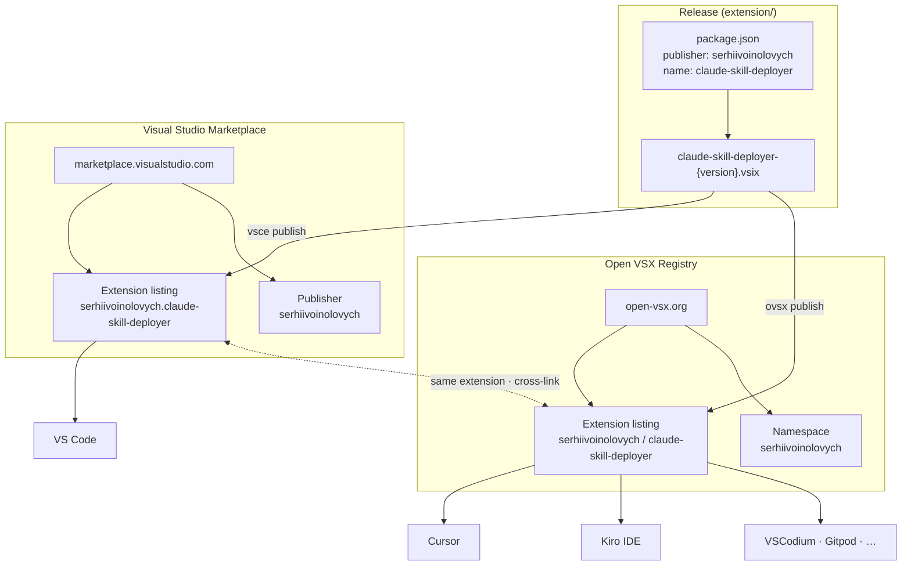

# Extension distribution — VS Marketplace ↔ Open VSX

**Claude Skills Manager** ships as one `.vsix` to **two registries**. Editors pick the gallery they use by default.

## Quick navigation

| | [Visual Studio Marketplace](https://marketplace.visualstudio.com/) | [Open VSX](https://open-vsx.org/) |
|---|---|---|
| **Used by** | **VS Code** | **Cursor**, **Kiro IDE**, VSCodium, Gitpod |
| **This extension** | [claude-skill-deployer](https://marketplace.visualstudio.com/items?itemName=serhiivoinolovych.claude-skill-deployer) | [claude-skill-deployer](https://open-vsx.org/extension/serhiivoinolovych/claude-skill-deployer) |
| **Publisher / namespace** | [serhiivoinolovych](https://marketplace.visualstudio.com/publishers/serhiivoinolovych) | [serhiivoinolovych](https://open-vsx.org/namespace/serhiivoinolovych) |
| **Install in editor** | Extensions → search **Claude Skills Manager** | Extensions → search **Claude Skills Manager** |
| **Deep link** | `vscode:extension/serhiivoinolovych.claude-skill-deployer` | Open listing in browser, then **Download** or install from Extensions UI |

Kiro uses Open VSX as its default gallery ([Kiro extension registry](https://kiro.dev/docs/editor/extension-registry/)). There is **no separate Kiro marketplace** — one Open VSX publish covers Cursor and Kiro.

## Related docs

| Doc | Purpose |
|-----|---------|
| [README.md](../README.md) | Repo overview + install table |
| [extension/README.md](../extension/README.md) | Extension user guide |
| [extension/PUBLISHING.md](../extension/PUBLISHING.md) | Publish to both registries, namespace verification |
| [01-high-level-architecture.md](01-high-level-architecture.md) | Runtime architecture (after install) |

## Open VSX namespace verification

Extensions may show ⚠️ **unverified** until namespace ownership is claimed. See [Namespace Access](https://github.com/eclipse-openvsx/openvsx/wiki/Namespace-Access) and the [claim form for `serhiivoinolovych`](https://github.com/EclipseFdn/open-vsx.org/issues/new?template=claim-namespace-ownership.yml&namespace=serhiivoinolovych&title=Claiming%20namespace%20%60serhiivoinolovych%60) in [PUBLISHING.md](../extension/PUBLISHING.md).
