# High-level architecture

```mermaid
flowchart TB
  subgraph UI["VS Code / Cursor UI"]
    Tree["Activity Bar: Skills Tree"]
    Status["Status Bar<br/>(usage, credits, budget)"]
    Dash["Usage Report & Cost Dashboard"]
    Cmds["Commands<br/>(install, profile init, hooks…)"]
  end

  subgraph Ext["Extension core (extension/src)"]
    EP["extension.ts<br/>activate + commands"]
    SP["skillsProvider.ts<br/>tree view"]
    SO["skillOps.ts<br/>detect, copy, manifest"]
    AO["agentOps.ts<br/>multi-agent sync"]
    BP["branchProfiles.ts<br/>per-branch profiles"]
    PI["profileInit.ts<br/>role + agent-driven init"]
    WSS["workspaceSkillSync.ts<br/>propagate changes"]
    HO["hookOps.ts<br/>attribution & cost hooks"]
    AC["attributionCollector.ts<br/>transcript parsing"]
    CP["costPipeline.ts<br/>collect → analyze → optimize"]
    SF["skillFeedback.ts<br/>inefficiency + proposals"]
  end

  subgraph Library["Bundled library"]
    SL["skills_library/<br/>SKILL.md + manifest"]
    AG["agents.json<br/>Claude, Cursor, Kiro, Copilot"]
  end

  subgraph WS["Workspace (per project)"]
    CS[".claude/skills/<br/>source of truth"]
    Learn[".claude/learning/<br/>runs, feedback, proposals"]
    Local[".claude/*.local.json<br/>position, profile (gitignored)"]
    Overrides["settings.local.json<br/>skillOverrides on/off"]
  end

  subgraph Agents["AI agent paths (mirrored)"]
    Claude[".claude/skills/ + hooks"]
    Cursor[".cursor/skills/"]
    Kiro[".kiro/skills/"]
    Copilot[".github/instructions/"]
  end

  subgraph Global["User machine (~/)"]
    GS["~/.claude/skills/<br/>global library"]
    BPStore["~/.claude/learning/<br/>branch-profiles.json"]
    Transcripts["Agent transcripts<br/>(Claude, Cursor, …)"]
  end

  UI --> EP
  EP --> SP & SO & BP & PI & WSS & AC & CP & SF
  SL --> SO
  AG --> AO

  SO --> CS
  EP -->|"Install relevant / checkbox"| CS
  WSS -->|"syncWorkspaceToAll"| Agents
  CS --> Claude
  CS --> Cursor & Kiro & Copilot

  BP --> BPStore
  Learn --> AC & SF & CP
  Transcripts --> AC
  AC --> CP
  CP --> Dash & Status
```

## Layer summary

| Layer | Role |
|-------|------|
| `skills_library/` | Bundled catalog + manifest (`detect_globs`) |
| `.claude/skills/` | Workspace source of truth (git-tracked or personal via `.git/info/exclude`) |
| Multi-agent mirror | Same skills copied/transformed to Cursor, Kiro, Copilot paths |
| Branch profiles | Per-repo, per-branch skill sets in `~/.claude/learning/branch-profiles.json` |
| Profile init | Agent picks skills from catalog; extension always merges required platform skills |
| Learning folder | Runs, feedback, proposals — drives usage report and optimization |
| Hooks + transcripts | Attribute token cost and skill invocations back to specific skills |

## Where the extension is installed from

The same packaged extension is published to two registries — **VS Code** installs from [Visual Studio Marketplace](https://marketplace.visualstudio.com/items?itemName=serhiivoinolovych.claude-skill-deployer); **Cursor** and **Kiro** install from [Open VSX](https://open-vsx.org/extension/serhiivoinolovych/claude-skill-deployer). See [00-extension-registries.md](00-extension-registries.md) for the distribution map and cross-links.

← [Registries (VS Marketplace ↔ Open VSX)](00-extension-registries.md) · [Runtime architecture](01-high-level-architecture.md) · [Diagram index](README.md)
