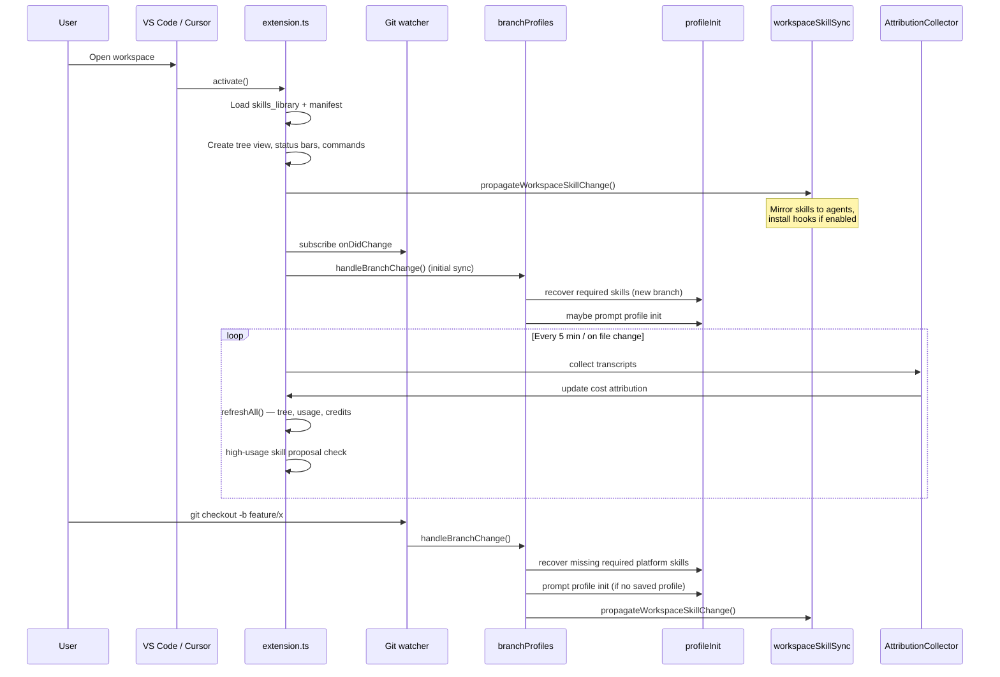

# Extension startup and refresh loop

```mermaid
sequenceDiagram
  participant User
  participant VSCode as VS Code / Cursor
  participant Ext as extension.ts
  participant Git as Git watcher
  participant BP as branchProfiles
  participant PI as profileInit
  participant WSS as workspaceSkillSync
  participant AC as AttributionCollector

  User->>VSCode: Open workspace
  VSCode->>Ext: activate()

  Ext->>Ext: Load skills_library + manifest
  Ext->>Ext: Create tree view, status bars, commands
  Ext->>WSS: propagateWorkspaceSkillChange()
  Note over WSS: Mirror skills to agents,<br/>install hooks if enabled

  Ext->>Git: subscribe onDidChange
  Ext->>BP: handleBranchChange() (initial sync)
  BP->>PI: recover required skills (new branch)
  BP->>PI: maybe prompt profile init

  loop Every 5 min / on file change
    Ext->>AC: collect transcripts
    AC->>Ext: update cost attribution
    Ext->>Ext: refreshAll() — tree, usage, credits
    Ext->>Ext: high-usage skill proposal check
  end

  User->>Git: git checkout -b feature/x
  Git->>BP: handleBranchChange()
  BP->>PI: recover missing required platform skills
  BP->>PI: prompt profile init (if no saved profile)
  BP->>WSS: propagateWorkspaceSkillChange()
```

← [Registries (VS Marketplace ↔ Open VSX)](00-extension-registries.md) · [Architecture overview](01-high-level-architecture.md) · [Diagram index](README.md)
