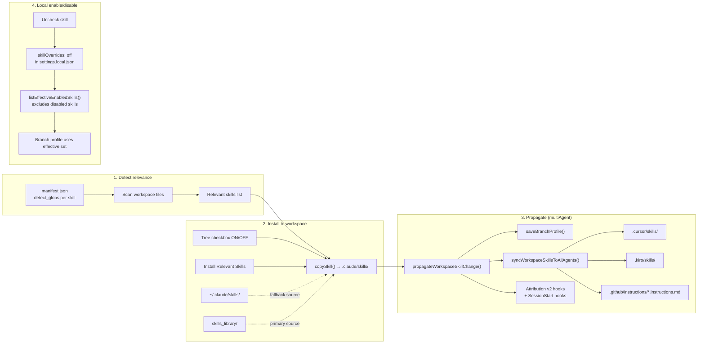

# Skill detection, install, and multi-agent sync

```mermaid
flowchart LR
  subgraph Detect["1. Detect relevance"]
    M["manifest.json<br/>detect_globs per skill"]
    Scan["Scan workspace files"]
    M --> Scan
    Scan --> Rel["Relevant skills list"]
  end

  subgraph Install["2. Install to workspace"]
    Rel --> Copy["copySkill() → .claude/skills/"]
    Tree["Tree checkbox ON/OFF"] --> Copy
    Cmd["Install Relevant Skills"] --> Copy
    Global["~/.claude/skills/"] -.->|"fallback source"| Copy
    Lib["skills_library/"] -.->|"primary source"| Copy
  end

  subgraph Sync["3. Propagate (multiAgent)"]
    Copy --> Prop["propagateWorkspaceSkillChange()"]
    Prop --> SaveBP["saveBranchProfile()"]
    Prop --> Mirror["syncWorkspaceSkillsToAllAgents()"]
    Mirror --> C[".cursor/skills/"]
    Mirror --> K[".kiro/skills/"]
    Mirror --> Co[".github/instructions/*.instructions.md"]
    Prop --> Hooks["Attribution v2 hooks<br/>+ SessionStart hooks"]
  end

  subgraph LocalCtrl["4. Local enable/disable"]
    Off["Uncheck skill"] --> Override["skillOverrides: off<br/>in settings.local.json"]
    Override --> Eff["listEffectiveEnabledSkills()<br/>excludes disabled skills"]
    Eff --> BP2["Branch profile uses effective set"]
  end
```
