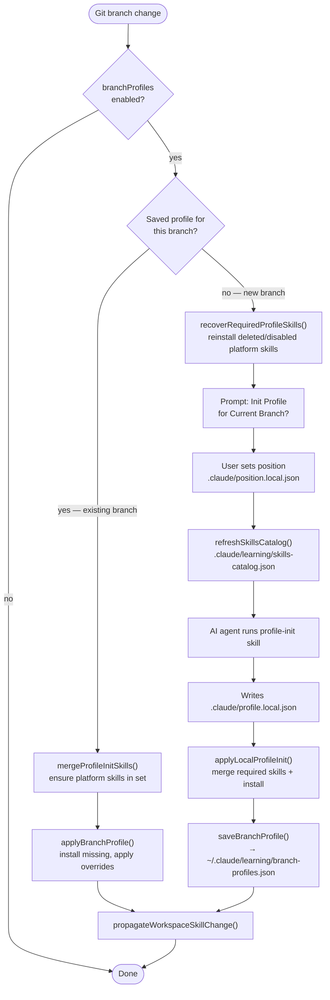

# Git branch profiles and profile init

```mermaid
flowchart TD
  Start(["Git branch change"]) --> Enabled{branchProfiles<br/>enabled?}
  Enabled -->|no| End(["Done"])
  Enabled -->|yes| HasProf{Saved profile for<br/>this branch?}

  HasProf -->|no — new branch| Recover["recoverRequiredProfileSkills()<br/>reinstall deleted/disabled platform skills"]
  Recover --> Prompt["Prompt: Init Profile<br/>for Current Branch?"]
  Prompt --> Pos["User sets position<br/>.claude/position.local.json"]
  Pos --> Catalog["refreshSkillsCatalog()<br/>.claude/learning/skills-catalog.json"]
  Catalog --> Agent["AI agent runs profile-init skill"]
  Agent --> Profile["Writes .claude/profile.local.json"]
  Profile --> Apply["applyLocalProfileInit()<br/>merge required skills + install"]
  Apply --> Save["saveBranchProfile()<br/>→ ~/.claude/learning/branch-profiles.json"]

  HasProf -->|yes — existing branch| Merge["mergeProfileInitSkills()<br/>ensure platform skills in set"]
  Merge --> ApplyProf["applyBranchProfile()<br/>install missing, apply overrides"]
  ApplyProf --> Sync["propagateWorkspaceSkillChange()"]
  Save --> Sync
  Sync --> End
```

← [Registries (VS Marketplace ↔ Open VSX)](00-extension-registries.md) · [Diagram index](README.md)
