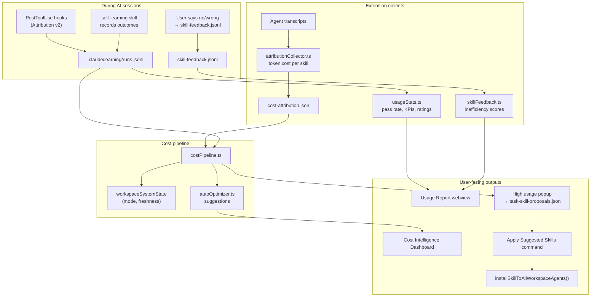

# Learning, cost intelligence, and feedback loop

```mermaid
flowchart TB
  subgraph Runtime["During AI sessions"]
    Hooks["PostToolUse hooks<br/>(Attribution v2)"]
    SL2["self-learning skill<br/>records outcomes"]
    FB["User says no/wrong<br/>→ skill-feedback.jsonl"]
    Hooks --> Runs[".claude/learning/runs.jsonl"]
    SL2 --> Runs
    FB --> Feedback["skill-feedback.jsonl"]
  end

  subgraph Collect["Extension collects"]
    Runs --> Stats["usageStats.ts<br/>pass rate, KPIs, ratings"]
    Feedback --> Ineff["skillFeedback.ts<br/>inefficiency scores"]
    Trans["Agent transcripts"] --> Attr["attributionCollector.ts<br/>token cost per skill"]
    Attr --> CostAttr["cost-attribution.json"]
  end

  subgraph Analyze["Cost pipeline"]
    CostAttr --> Pipe["costPipeline.ts"]
    Runs --> Pipe
    Pipe --> Sys["workspaceSystemState<br/>(mode, freshness)"]
    Pipe --> Opt["autoOptimizer.ts<br/>suggestions"]
  end

  subgraph UI2["User-facing outputs"]
    Stats --> Report["Usage Report webview"]
    Ineff --> Report
    Opt --> Dash2["Cost Intelligence Dashboard"]
    Pipe --> Alert["High usage popup<br/>→ task-skill-proposals.json"]
    Alert --> Apply2["Apply Suggested Skills command"]
    Apply2 --> Install2["installSkillToAllWorkspaceAgents()"]
  end
```
