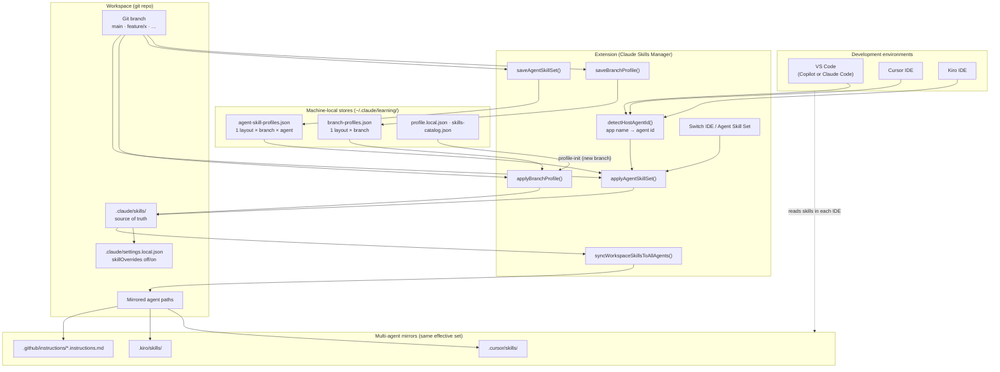
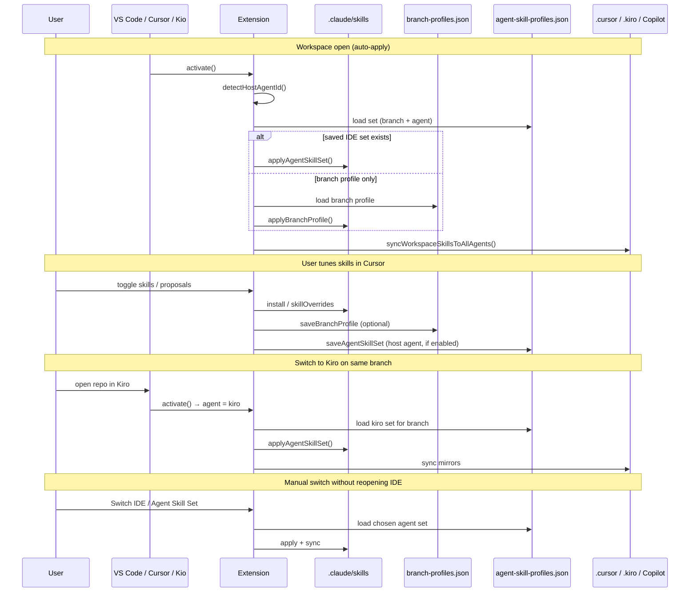
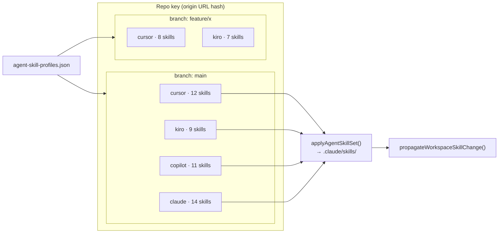

# IDE and branch skill profile flow

How **Claude Skills Manager** stores, switches, and mirrors skill layouts across **git branches** and **IDEs** (VS Code, Cursor, Kiro, Copilot / Claude Code).

## Architecture overview

## Save and restore paths

## Storage model (branch × agent)

| Store | Key | Purpose |
|-------|-----|---------|
| `branch-profiles.json` | repo + **branch** | Default per-branch layout (git switch) |
| `agent-skill-profiles.json` | repo + **branch** + **agent** | Per-IDE layout (Cursor vs Kiro vs VS Code) |
| `.claude/skills/` | workspace | Git-tracked or personal skill files (source of truth) |
| `.claude/settings.local.json` | workspace | Personal `skillOverrides` (disable without deleting team files) |

## Host agent detection

| Editor | Detected agent id | Setting override |
|--------|-------------------|------------------|
| Cursor | `cursor` | — |
| Kiro | `kiro` | — |
| VS Code | `copilot` (default) or `claude` | `claudeSkills.agentProfiles.vscodeAgent` |
| Any | forced id | `claudeSkills.agentProfiles.hostAgentOverride` |

## Commands

| Command | Effect |
|---------|--------|
| **Save Skill Set for Current IDE** | Write current effective skills → `agent-skill-profiles.json` for host agent + branch |
| **Switch IDE / Agent Skill Set** | Apply another agent's saved set to `.claude/skills/` and sync mirrors |
| **Save Branch Skill Profile** | Write → `branch-profiles.json` (all IDEs share on branch switch if no IDE set) |
| **Apply Branch Skill Profile** | Restore branch default from `branch-profiles.json` |

## Related diagrams

- [04-branch-profiles-profile-init.md](04-branch-profiles-profile-init.md) — branch switch and profile-init
- [03-skill-install-sync.md](03-skill-install-sync.md) — multi-agent mirror after `.claude/skills` changes
- [00-extension-registries.md](00-extension-registries.md) — installing the extension in each IDE

**Draw.io (editable):** [docs/diagrams/skill-profiles-ide-branch-flow.drawio](../docs/diagrams/skill-profiles-ide-branch-flow.drawio)

← [Diagram index](README.md)
