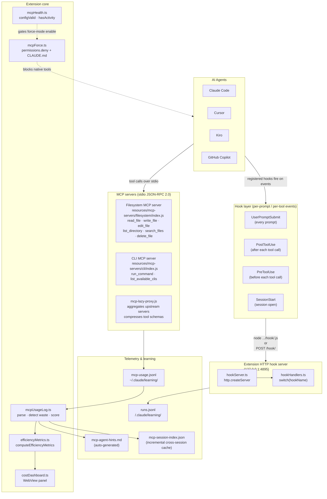
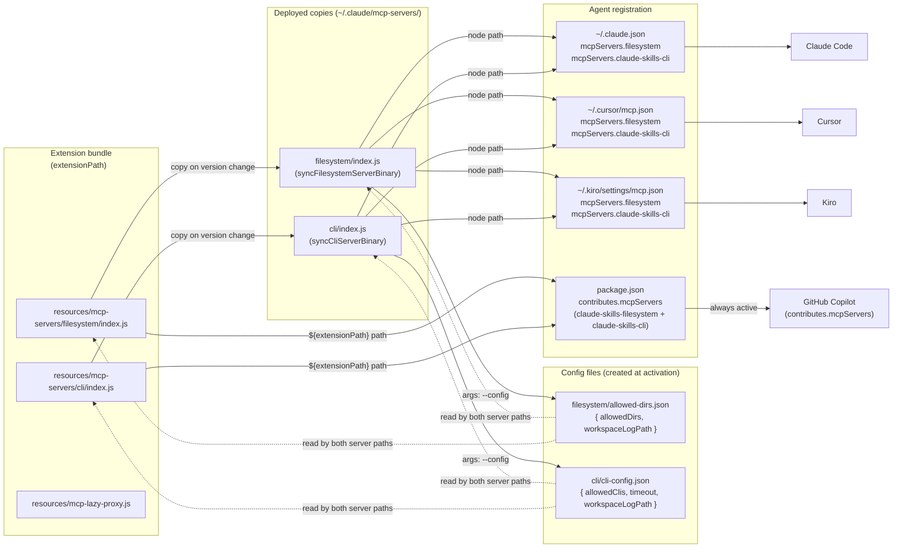
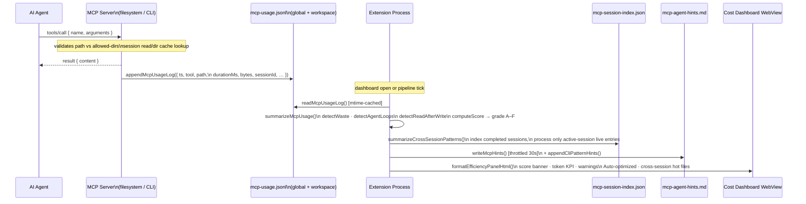
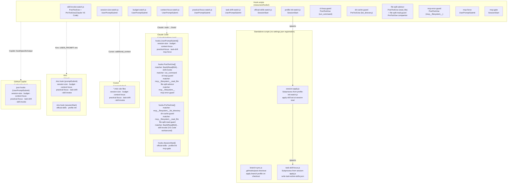
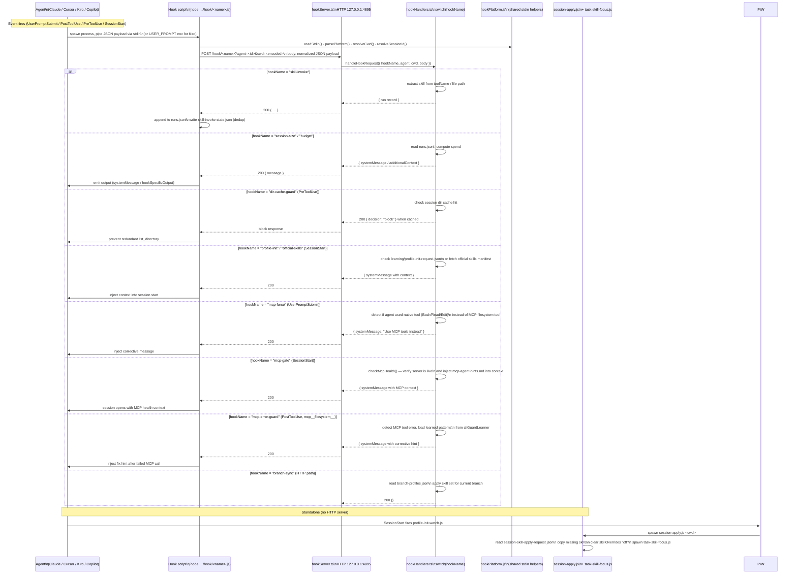
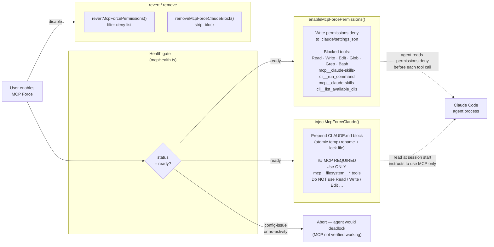

# Hook System & MCP Architecture

## 1. Overview — how hooks and MCP servers fit together

---

## 2. MCP server deployment & registration per agent

---

## 3. MCP data flow: tool call → telemetry → dashboard

---

## 4. Hook registration per agent

---

## 5. Hook dispatch flow (HTTP server path)

---

## 6. MCP Force enforcement

---

## 7. Hook × agent capability matrix

| Hook | Event | Matcher | Claude Code | Cursor | Kiro | Copilot |
|---|---|---|---|---|---|---|
| `skill-invoke` | PostToolUse | `Bash\|Read\|Edit\|…` | `settings.json` | `.mdc` rule | `.kiro.hook` promptSubmit | `.github/hooks/` |
| `skill-invoke` | PreToolUse *(VS Code workaround)* | `Bash\|Read\|Edit\|…` | `settings.json` | — | — | — |
| `session-size` | UserPromptSubmit | — | `settings.json` | `.mdc` rule | `.kiro.hook` | `.github/hooks/` |
| `budget` | UserPromptSubmit | — | `settings.json` | `.mdc` rule | `.kiro.hook` | `.github/hooks/` |
| `context-focus` | UserPromptSubmit | — | `settings.json` | `.mdc` rule | `.kiro.hook` | `.github/hooks/` |
| `practical-focus` | UserPromptSubmit | — | `settings.json` | `.mdc` rule | `.kiro.hook` | `.github/hooks/` |
| `task-drift` | UserPromptSubmit | — | `settings.json` | `.mdc` rule | `.kiro.hook` | `.github/hooks/` |
| `mcp-force` | UserPromptSubmit | — | `settings.json` | — | — | — |
| `official-skills` | SessionStart | — | `settings.json` | — | `.kiro.hook` sessionStart | — |
| `profile-init` | SessionStart | — | `settings.json` | — | `.kiro.hook` sessionStart | — |
| `mcp-gate` | SessionStart | — | `settings.json` | — | — | — |
| `cli-loop-guard` | PostToolUse | `mcp__claude-skills-cli__run_command` | `settings.json` | — | — | — |
| `mcp-error-guard` | PostToolUse | `mcp__filesystem__` | `settings.json` | — | — | — |
| `file-split-advisor` | PostToolUse | `mcp__filesystem__read_file` | `settings.json` | — | — | — |
| `file-split-read-guard` | PreToolUse | `mcp__filesystem__read_file` | `settings.json` *(paired with advisor)* | — | — | — |
| `dir-cache-guard` | PreToolUse | `mcp__filesystem__list_directory` | `settings.json` | — | — | — |
| `branch-sync` | git `post-checkout` / HTTP | — | `.git/hooks/post-checkout` + HTTP | — | — | — |
| `session-apply` | Subprocess *(from profile-init-watch)* | — | headless only | — | — | — |
| `task-skill-focus` | Subprocess *(from session-apply)* | — | headless only | — | — | — |

---

## Key file locations

| Artifact | Path |
|---|---|
| MCP filesystem server (bundled) | `${extensionPath}/resources/mcp-servers/filesystem/index.js` |
| MCP CLI server (bundled) | `${extensionPath}/resources/mcp-servers/cli/index.js` |
| MCP lazy proxy | `${extensionPath}/resources/mcp-lazy-proxy.js` |
| MCP filesystem server (deployed) | `~/.claude/mcp-servers/filesystem/index.js` |
| MCP CLI server (deployed) | `~/.claude/mcp-servers/cli/index.js` |
| Filesystem allowed dirs config | `~/.claude/mcp-servers/filesystem/allowed-dirs.json` |
| CLI allowed CLIs config | `~/.claude/mcp-servers/cli/cli-config.json` |
| Global MCP usage telemetry | `~/.claude/learning/mcp-usage.jsonl` |
| Workspace MCP telemetry | `<workspace>/.claude/mcp-usage.jsonl` |
| Session index (incremental cross-session) | `~/.claude/learning/mcp-session-index.json` |
| Auto-generated agent hints | `~/.claude/learning/mcp-agent-hints.md` |
| Hook scripts (HTTP-dispatched) | `${extensionPath}/resources/hooks/*.js` |
| Standalone hook scripts | `${extensionPath}/resources/hooks/branch-sync.js`, `session-apply.js`, `task-skill-focus.js` |
| Claude hook registration | `<workspace>/.claude/settings.json` |
| Cursor hook registration | `<workspace>/.cursor/rules/*.mdc` |
| Kiro hook registration | `<workspace>/.kiro/*.kiro.hook` |
| Copilot hook registration | `<workspace>/.github/hooks/*.json` |
| Skill attribution log | `<workspace>/.claude/learning/runs.jsonl` |
| MCP Force permissions | `<workspace>/.claude/settings.json` → `permissions.deny` |

← [IDE & agent skill profiles](06-ide-agent-skill-profiles.md) · [Diagram index](README.md)
